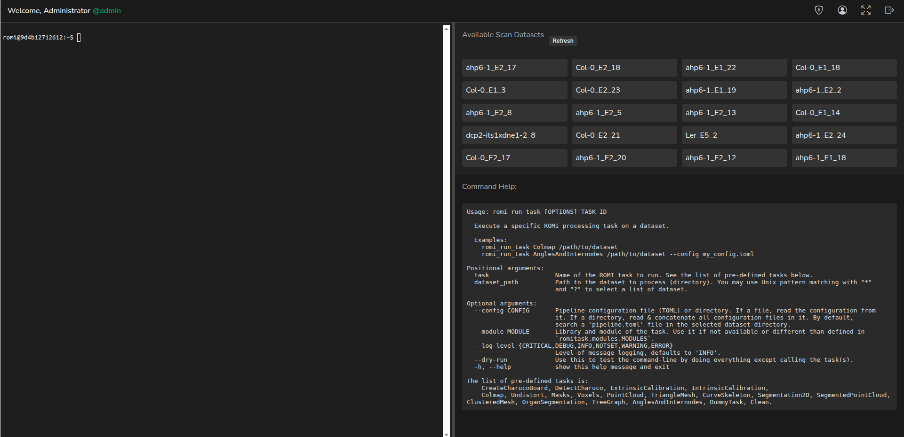

# Plant3DVision - WebTerm

WebTerm is a secure web-based terminal access system that provides authenticated users with browser-based terminal capabilities.
It allows for remote command execution in a secure environment with user management features and integration with ROMI scan datasets.

<div style="text-align:center; width:100%;">
    
</div>

## Features

- **Secure Authentication**: User login with password hashing via bcrypt-SHA256
- **Web Terminal**: Full-featured terminal emulation in the browser using xterm.js
- **User Management**:
    - Admin panel for adding new users
    - User profile management with password change functionality

- **ROMI Integration**: Access and manage ROMI scan datasets
- **Responsive Design**: Resizable terminal interface with split view
- **Session Management**: Persistent terminal sessions between page refreshes

## Installation

### Prerequisites

- Python 3.9+
- The following Python packages:
    - Flask
    - Flask-SocketIO
    - eventlet
    - bcrypt
    - plantdb.commons

### Setup

#### Developer mode

1. Run the application with Gunicorn:
    ```bash
   python plant3dvision/webterm/app.py
    ```
1. Access the application in your browser at `http://localhost:8080`

#### Production mode

1. Configure environment variables (optional):
    ```bash
    export ROMI_DB="/path/to/romi/database"  # default to '/myapp/db'
    export ROMI_CFG="/path/to/romi/cfg"  # default to '/myapp/cfg'
    export WEBTERM_USERS="/path/to/romi/users.csv"  # default to 'users.csv' 
    export SERVER_SECRET_KEY="your-secret-key"  # randomly generated by default
    export SERVER_HOST="0.0.0.0"  # default
    export SERVER_PORT="8080"  # default
    export SERVER_DEBUG="False"  # default
    export SERVER_LOG_LEVEL="INFO"  # default
    export WEBTERM_PREFIX="/webterm"  # default to ""
    ```
1. Run the application:
    ```bash
    gunicorn --worker-class eventlet -w 1 --bind 0.0.0.0:8080 plant3dvision.webterm.wsgi:application
    ```
1. Access the application in your browser at `http://localhost:8080`

## Usage

### Initial Login

When first started, the system creates a default admin user:

- Username: `admin`
- Password: `admin`

It is recommended to **change this password immediately** after the first login.

### Admin Functions

As an admin user, you can:

- Add new users through the admin panel
- Access all terminal functions
- View and manage all scan datasets

### Regular User Functions

Regular users can:

- Access the terminal with their own persistent session
- Change their password through the user profile
- View available scan datasets
- Execute commands based on their system permissions

### Terminal Commands

The terminal provides access to ROMI-specific commands, including:

``` 
romi_run_task [OPTIONS] TASK_ID
```

Available tasks include:

- CreateCharucoBoard, DetectCharuco, ExtrinsicCalibration
- Colmap, Undistort, Masks, Voxels, PointCloud
- TriangleMesh, CurveSkeleton, Segmentation2D
- SegmentedPointCloud, ClusteredMesh, OrganSegmentation
- TreeGraph, AnglesAndInternodes

## Architecture

WebTerm is built using:

- **Backend**: Flask and Flask-SocketIO for the web server and WebSocket communication
- **Frontend**: HTML, CSS, JavaScript with `xterm.js` for terminal emulation
- **Authentication**: Custom user management with bcrypt-SHA256 password hashing
- **Terminal**: Python's pty module for creating pseudo-terminals

## Acknowledgments

- This tool is part of the Plant-3D-Vision library
- `xterm.js` for the terminal emulation capabilities
- ROMI project for the scan dataset integration
